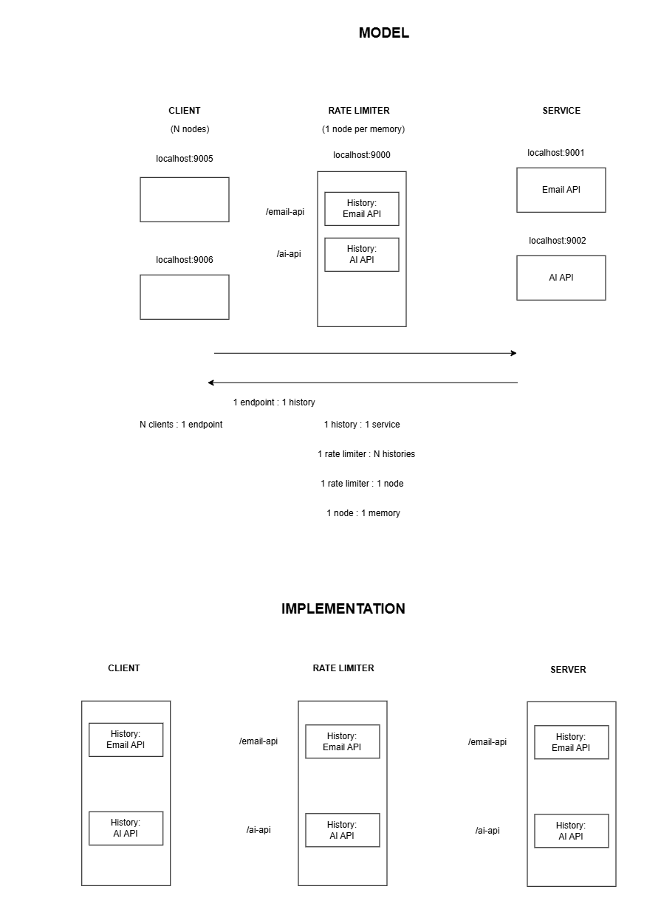

# Rate Limiter

This is the Rate Limiter Project. These are its components:

- [Rate Limiter](https://github.com/tave8/rate-limiter). The server rate limiting N services. It sits in between client and server. It's this repo.

- [Algorithm](https://github.com/tave8/rate-limiter-algo). The agnostic rate limiting logic. A library that is included in the other components.

- [Client](https://github.com/tave8/rate-limiter-client). The application acting as N clients sending requests to the rate limiter.

- [Server](https://github.com/tave8/rate-limiter-server). The server acting as N services to be rate limited.

## Get started

1. Clone all repositories into the same directory
2. Open a terminal in that directory
3. Run the python script `python server_automation.py`.

If you don't change anything manually, this is all you need to do.

Note: The processes currently open at the ports that are intended for usage in this project, will be killed. Running the command builds each server and runs it; It does not automatically update the urls/ports for each subproject. So if you change ports, you also have to update the urls/ports manually, where relevant. Fortunately, it's very easy; Just go in the `resources` directory for the *client* and *rate limiter*, and update the json that you see in there, with the new url/port.

